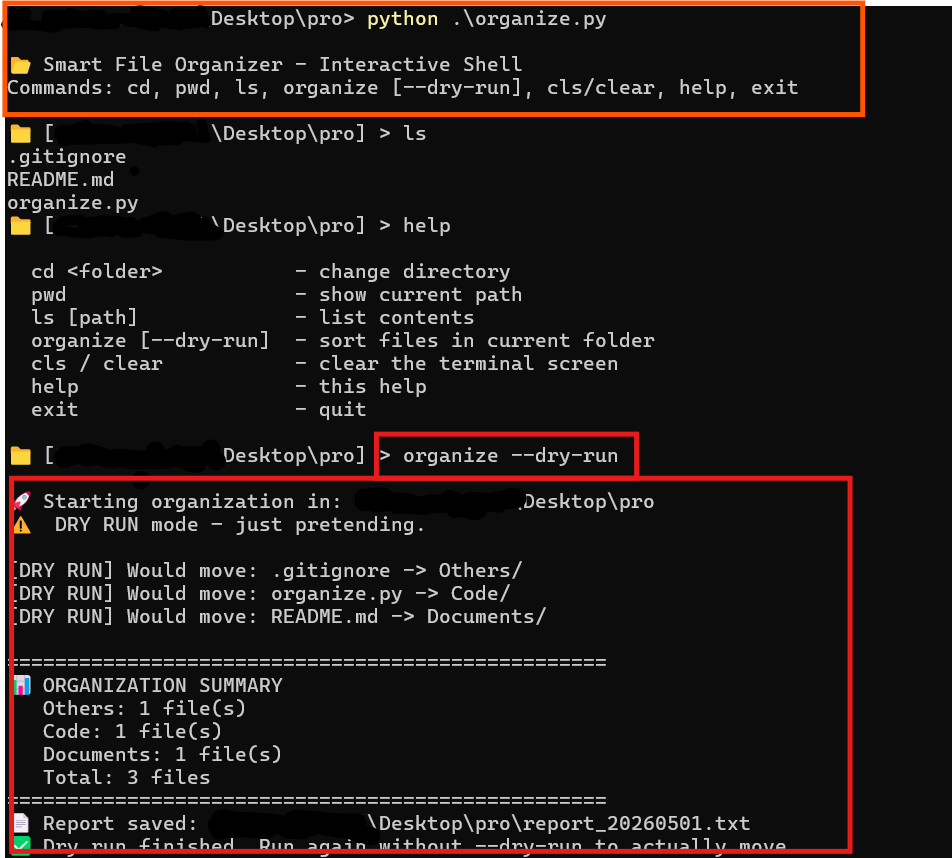

# 📂 Smart File Organizer (Just using Python)

This Python script cleans up messy folders by automatically sorting files into categories like Images, Documents, Videos, Code, and more. You can run it directly on a folder or use the built‑in interactive shell to `cd` around and decide which folder to organize. No extra packages.

##  What This Script Actually Does ?

- Scans a folder you choose (e.g., `Downloads` or `Desktop`)
- Looks at every file's extension (`.jpg`, `.pdf`, `.py`, etc)
- Creates category subfolders if they don't exist (`Images/`, `Documents/`, `Code/`, etc.)
- Moves each file into the matching category folder
- Leaves unknown file types in an `Others/` folder
- Has a **dry‑run mode** (`--dry-run`). shows what it *would* do without moving anything
- Provides an **interactive shell** where you can `cd`, `ls`, then `organize` when ready
- Writes a detailed log file and a summary report so you can review everything later

##  Key Features

| Feature | Description |
|---------|-------------|
| **Automatic category detection** | Pre‑defined rules for images, documents, videos, archives, code. easily customizable |
| **Dry‑run mode** | Preview changes before touching your data, safe and transparent. |
| **Interactive shell** | Type `python organizer.py`, then use `cd`, `ls`,`cls/clear`, `organize`, like a mini file manager |
| **Full logging** | Every move is recorded in `organize_log.txt` inside the target folder |
| **Summary report** | A clean text report (`report_YYYYMMDD.txt`) with file counts per category. |
| **Handles errors gracefully** | If a file can't be moved (permissions, long name), it logs the error and continues. |
| **No external dependencies** | Uses only Python's standard library (`os`, `shutil`, `logging`, `pathlib`, …) |
| **Cross‑platform** | Works on Windows, macOS, and Linux |

##  Requirements

- Python 3.6 or higher
- No extra packages to install, only pure standard library

##  **When Is This Tool NOT a Good Fit?**

- **Huge folders (millions of files)**  it moves files one by one; for massive batch jobs, consider `rsync` or a parallel version
- **Moving files across a slow network drive**  may take extra time.
- **Advanced filtering (by date, name pattern, or content)**  this script only looks at file extensions
- **You need to preserve original creation dates**  moving files inside the same filesystem usually keeps metadata, but moving across drives may change some attributes

> **Best for:** local folders with a few thousand files  your Downloads, Desktop, or project temp folders

##  Who Can Benefit from This Tool?

| Role / Situation | How This Tool Helps |
|------------------|----------------------|
| **Student / Developer** | Your Downloads folder is a mess of PDFs, images, and code? Run this and get instant order. |
| **Content creator** | Sort raw video clips, thumbnails, and audio files into separate folders. |
| **System administrator** | Quickly tidy up user upload directories or log folders before archiving. |
| **Data analyst** | Separate CSV/XLSX files from scripts and documentation. |
| **Casual user** | One command, all your files neatly sorted. No manual dragging. |

> **No programming skills required**, just double‑click or run one command.

##  How to Use

### 1. Interactive shell (recommended. easiest to explore)

Open a terminal in the script's folder and type:

```bash
python organizer.py 
```

- You'll see a prompt like 📁 [C:\Users\ your path ] > Now you can:

- `cd Downloads` – go into your Downloads folder
- `ls` – see what's inside
- `organize --dry-run` – preview what would happen
- `organize` – actually sort the files
- `cls / clear` - clear terminal

Type `help` for all commands, `exit` to quit

> **Here’s how it looks in real life:**  
> 

### 2. Direct command line (one‑shot)

If you already know which folder to clean:

```bash
python organizer.py "C:\Users\you\Downloads"
```

Add --dry-run to simulate:

```bash
python organizer.py "C:\Users\you\Downloads" --dry-run
```

### 3. Double‑click (Windows)

Double‑click the script, it will open a terminal and start the interactive shell automatically.
📁 Example

Before (inside Downloads folder):


receipt.pdf
sunset.jpg
script.py
notes.txt
random.xyz

After running organize:
text

Downloads/
├── Images/
│   └── sunset.jpg
├── Documents/
│   ├── receipt.pdf
│   └── notes.txt
├── Code/
│   └── script.py
├── Others/
│   └── random.xyz
├── organize_log.txt
└── report_20250430.txt

🛠 How It Works (simple explanation)

    You give it a folder path (or cd there in interactive mode)

    The script scans every file, reads its extension

    It looks up the extension in a built‑in dictionary: images, documents, videos, archives, code

    If the target category folder doesn’t exist, it creates it

    It moves the file into that folder

    If you use --dry-run, it prints what it would do without actually moving anything

    Every move is written to a log file, and a final report is created


**⭐ If this tool saved you from a messy folder headache, give the repo a star!**